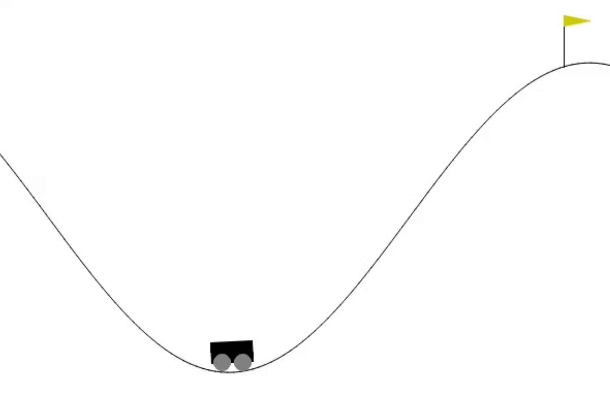

# PPO-PyTorch

This repository contains an implementation of Proximal Policy Optimization (PPO) using PyTorch. The program is based on the [PPO paper](https://arxiv.org/abs/1707.06347) and is designed to train agents in OpenAI's [Gymnasium](https://gymnasium.farama.org/) environments.

## Results

| MountainCarContinuous-v0  | MountainCarContinuous-v0 |
|:-------------------------:|:-------------------------:|

| </img> |   |

| Ant-v5  | Ant-v5 |
| :-------------------------:|:-------------------------: |
|  |   |

| HalfCheetah-v5 | HalfCheetah-v5 |
| :-------------------------:|:-------------------------: |
|  |   |

| Humanoid-v5  | Humanoid-v5 |
| :-------------------------:|:-------------------------: |
|  |   |
